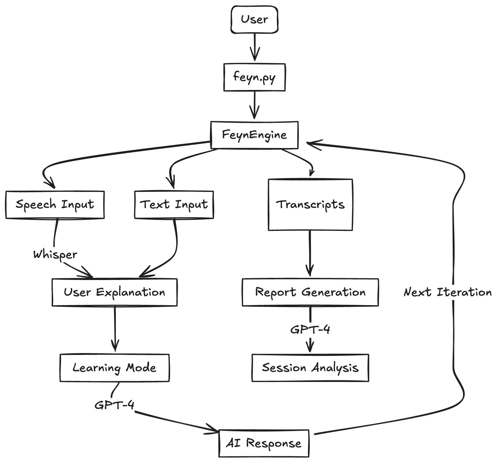
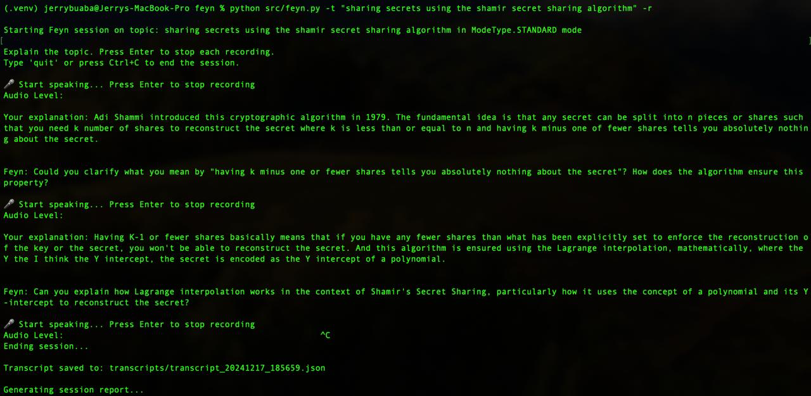

# Feyn

Learn anything using the Feynman Technique, but with an LLM. Bootstrapped by [Strappa](https://github.com/buabaj/strappa)

## Overview

Feyn is a command-line tool that helps you learn and understand concepts deeply using the Feynman Technique - the practice of learning by teaching. It uses AI to simulate a dynamic learning session where you explain concepts aloud or in text, and the LLM, Feyn, asks targeted questions to identify and fill gaps in your understanding.

## Design



## Features

- **Speech Recognition**: Explain concepts naturally through speech using OpenAI's Whisper
- **Multi-Mode Learning**:
  - `standard`: Classic Feynman Technique with step-by-step questioning
  - `quiz`: Active recall focused on testing understanding
  - `challenge`: Advanced mode exploring edge cases and deeper concepts
- **Text or Speech**: Choose between voice explanations or text input
- **Session Transcripts**: Automatically save your learning sessions
- **Progress Reports**: Generate AI analysis of your understanding and progress

## Installation

1. Clone the repository:

```bash
git clone https://github.com/buabaj/feyn.git
cd feyn
```

2. Install dependencies:

```bash
pip install -r requirements.txt
```

3. Set up your OpenAI API key:

```bash
touch .env
echo OPENAI_API_KEY='your-api-key-here' > .env
```

## Options

- `-t, --topic`: Topic to learn/explain (required)
- `-m, --mode`: Learning mode (standard, quiz, challenge)
- `--text`: Use text input instead of speech
- `-p, --path`: Custom path to save transcripts
- `-r, --report`: Generate a session report

## Usage



Basic usage with speech input:

```bash
python src/feyn.py -t "DNA Sequencing" -m standard -r
```

## During a Session

### Speech Mode

1. Start explaining when you see the 🎤 indicator
2. Press Enter to stop each recording
3. Wait for AI feedback and continue the dialogue
4. Press Ctrl+C to end session

### Text Mode

1. Type your explanation
2. Press Enter twice to finish each explanation
3. Type 'quit' or press Ctrl+C to end session

## Todo

- [x]  Speech recognition with OpenAI Whisper
- [x]  Multiple learning modes (standard, quiz, challenge)
- [x]  Text input option
- [x]  Basic session transcripts
- [x]  Session reports
- [x]  Real-time audio level indicator
- [ ]  Visual concept mapping
- [ ]  Terminal UI with rich formatting
- [ ]  Web interface
- [ ]  Export to different formats
- [ ]  Learning path suggestions
- [ ]  Knowledge graph generation
